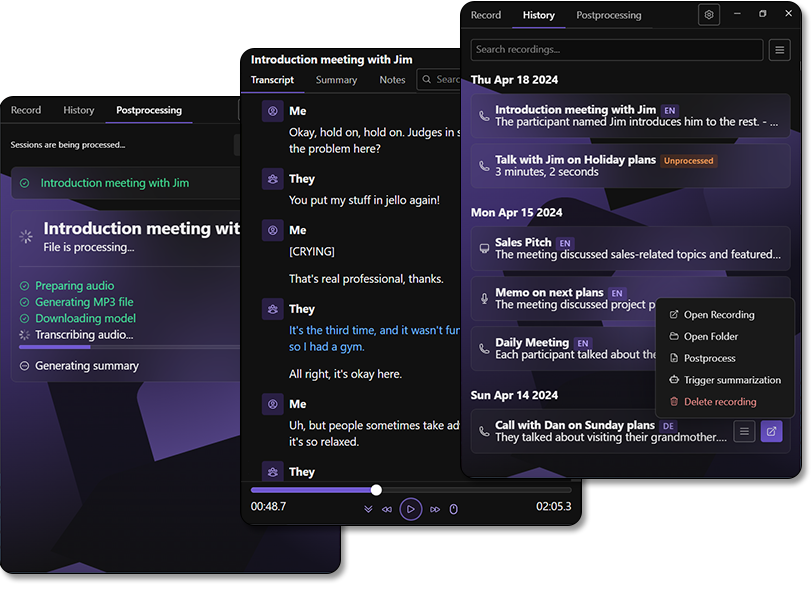

#  Pensieve

> Desktop app for recording meetings from locally running apps and transcribing and summarizing them with a local LLM

    <a href="https://github.com/lukasbach/pensieve/releases/latest">
        Download the latest release
    </a>

 

    

 

Pensieve is a local-only desktop app for recording meetings, discussions or other audio
snippets from locally running applications for you to always go back and review your
previous discussions.

It uses a bundled Whisper instance to transcribe the audio locally, and optionally
summarizes the transcriptions with an LLM. You can connect a local Ollama instance to
be used for summarization, or provide an OpenAI key and have ChatGPT summarize the
transcriptions for you.

If you choose Ollama for summarization (or disable summarization entirely), all your
data stays on your machine and is never sent to any external service. You can record
as many meetings as you want, and manage your data yourself without any external
providers involved.

Pensieve automatically registers a tray icon and runs in the background, which
makes it easy to start and stop recordings at any time. You can also configure
Pensieve in many ways, like customizing which models to use for transcription
and summarization, or various audio processing settings.

    <a href="https://github.com/lukasbach/pensieve/releases/latest">
        Download the latest release
    </a>

